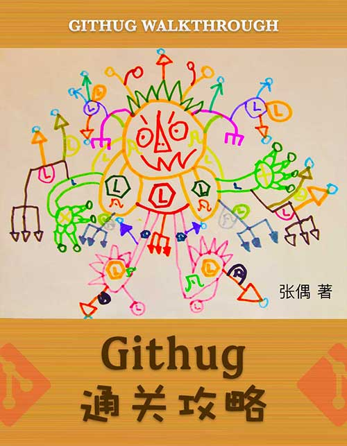

# Githug 通关攻略

Githug 是一个学习 Git 的游戏，让你在游戏中轻松学习和理解 Git 的强大功能，本书详细讲解了每一关任务产生的背景、解决问题的思路和方法，并提供了清晰的过关画面。

本书地址：[https://githug.zhang-ou.com](https://githug.zhang-ou.com)

作者：张偶

作者博客：[http://www.zhang-ou.com](http://www.zhang-ou.com)

封面插图由张子凡同学提供。

移动端请扫码阅读：

### License

This work is licensed under a [Creative Commons Attribution-NonCommercial 4.0 International License](https://creativecommons.org/licenses/by-nc/4.0/).
