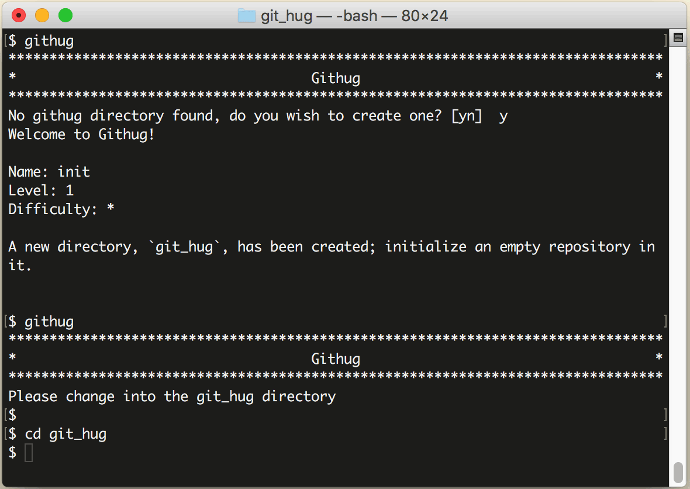
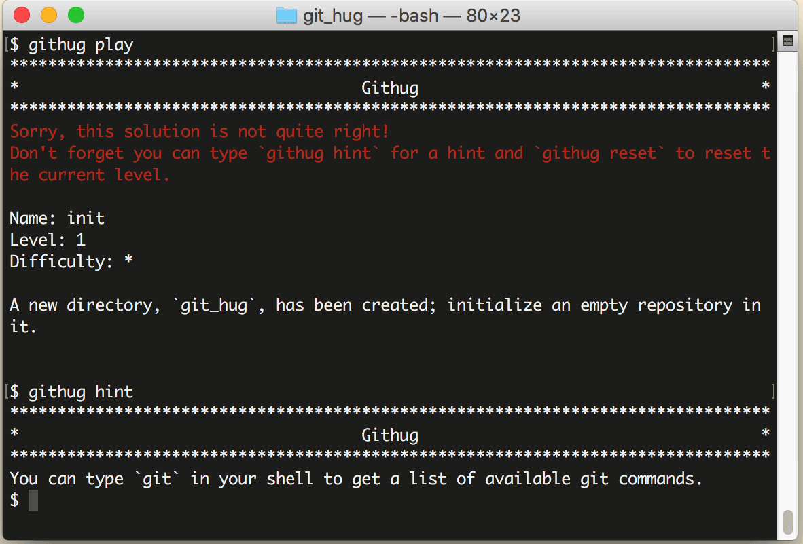

# 安装和使用方法

先安装好 [git](https://git-scm.com/) 和 [ruby](https://www.ruby-lang.org/) 的运行环境，略。

Githug 运行在 ruby 环境下，通过 gem 安装：

```
$ gem install githug
```

安装好之后，输入命令 `githug`，屏幕会提示“No githug directory found, do you wish to create one? ”，输入 `y` 后回车，提示已经创建了一个名为 git_hug 的新目录，并显示第1关的名称、难度和任务。切换到 git_hug 目录，准备开始闯关。



在闯关之间先学习 githug 的4个内部命令：

* `githug play`：闯关，即验证你是否已经完成了关卡要求的任务，如果完成了，就会自动跳到下一关。因为这个命令最常用，所以可以缩写成 githug，省略后面的 play。

* `githug hint`：提示，如果你对某个任务没有头绪，可以从这个提示信息得到一些启发。

* `githug reset`：重置，执行任务的过程是用 git 命令操作文件，但是如果改来改去地把文件弄乱了想重新过这关，就要用这个命令恢复到初始状态。

* `githug levels`：查看55关的各自名称。

下图是执行 `githug play` 和 `githug hint` 命令的效果：



因为第1关还没过，所以用红字警告 "Sorry, this solution is not quite right!"（任务还没有完全解决呢），给出的提示是 "You can type 'git' in your shell to get a list of available git commands."（先用 'git' 命令列出常用命令看看吧）。