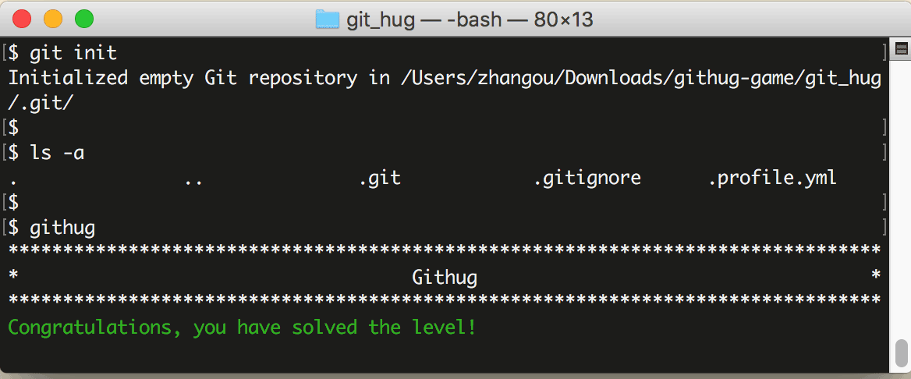

# 第1关 init

> A new directory, ‘git_hug’, has been created; initialize an empty repository in it.
> 
> 把 'git_hug' 这个新建的目录变为一个可以被 Git 管理的仓库。

如果你准备把一个本地目录让 Git 管理起来，要先做初始化工作。本地目录可以是空目录，也可以是已经存有文件的目录。

Git 仓库的初始化命令是：

```
$ git init
```

该命令将创建一个名为 .git 的子目录，这个子目录含有 Git 管理仓库时要用的文件，.git 是一个隐藏目录，可以用 `ls -a` 查看。

