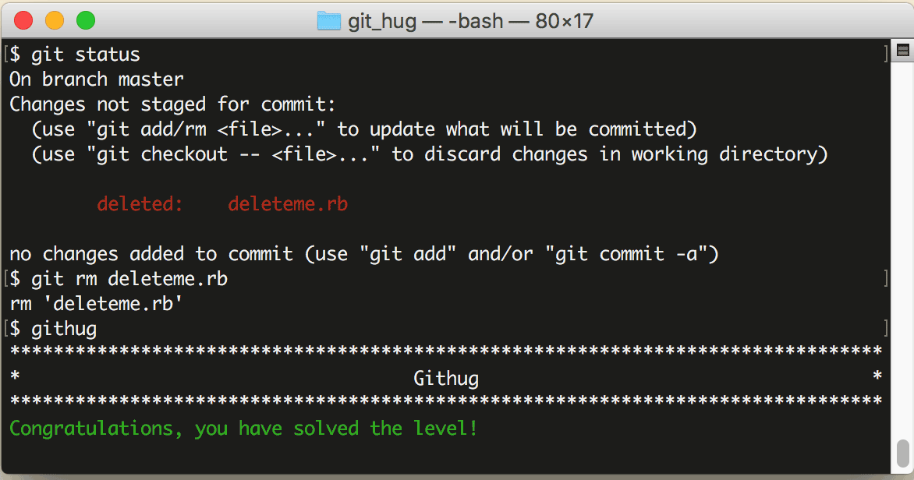

# 第11关 rm

> A file has been removed from the working tree, however the file was not removed from the repository.  Find out what this file was and remove it.
> 
> 有一个文件被从工作目录中直接删除了，而没有通知到仓库，找到这个文件，把它从仓库中删除。

如果一个文件无用了，准备删除它，切记不要直接用 `rm` 命令，你应该用 Git 包装过的 `git rm` 命令，否则 Git 仓库不知道你对这个文件进行了删除操作，就追踪不到这个文件的变化了。

第11关过关画面如下：

