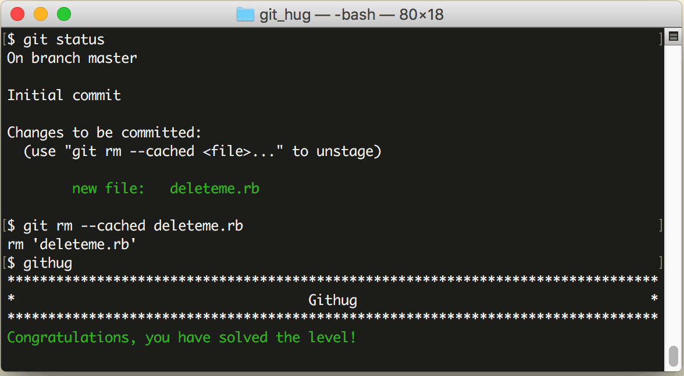

# 第12关 rm_cached

> A file has accidentally been added to your staging area, find out which file and remove it from the staging area.  \*NOTE\* Do not remove the file from the file system, only from git.
> 
> 有一个文件不小心被添加到了暂存区，找到它，然后把它从暂存区中删除。\*注意\* 不是要把它从文件系统里删除，只是要从 Git 暂存区删除。

有时候，我们用 `git add` 命令添加到暂存区的文件中无意中包含了不应该添加的文件，这时如果要撤销添加，就要做 `git add` 的逆操作。能进能退，Git 方为真正法器。

撤销添加到暂存区的命令仍是 `git rm`，但要加一个 `--cached` 参数，如下面所示：

```
$ git rm --cached your-file
```

第12关过关画面如下：

