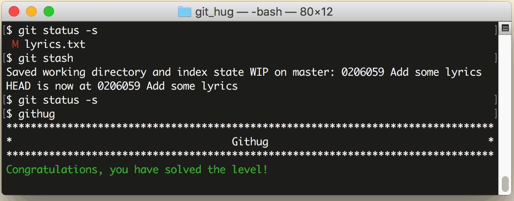

# 第13关 stash

> You've made some changes and want to work on them later. You should save them, but don't commit them.
>
> 你修改了一个文件，但还没改完，这时你要保存它，而不是提交它。

设想这样的场景：你正为一个类文件写一个新方法，写到一半了但还没写完，这时来了一个紧急任务，需要修改这个类的另一个方法，然后提交。现在你面临的问题是，手头的活儿还没干完，就又来新活儿了，而且是处理同一个文件！好吧，让我们思考一下操作系统是怎么处理这种情况的：外部中断到来时，系统会挂起当前进程，然后处理中断事件，处理完中断事件以后再恢复之前挂起的进程。`git stash` 命令就是类似这样的一种处理方式，它会把当前环境“藏”到一个临时区域，然后把工作环境恢复为最后一次提交的状态，这时你可以从刚才的工作状态跳出来在一个干净的工作环境处理紧急任务，之后再用 `git stash pop` 命令恢复此前“藏”的工作环境。

相关命令如下：

```
$ git stash
$ git stash list
$ git stash pop
```

第1条命令把当前环境“藏”起来；第2条命令列出被“藏”的环境；第3条命令恢复被“藏”的环境。

第13关过关画面如下：

