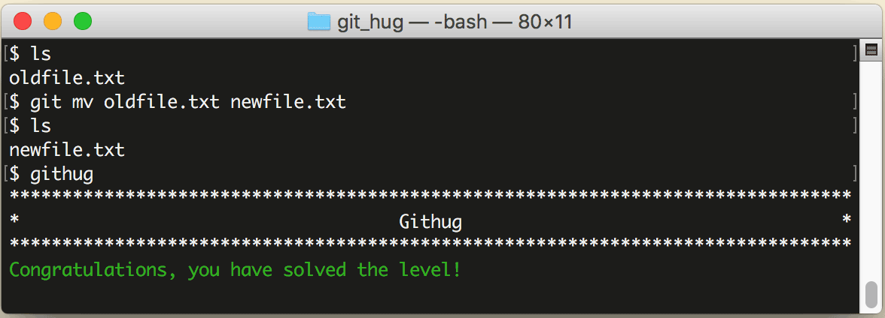

# 第14关 rename

> We have a file called 'oldfile.txt'. We want to rename it to 'newfile.txt' and stage this change.
> 
> 有一个名为 'oldfile.txt' 的文件，要把它改名为 'newfile.txt'，并且把这个改动记录到暂存区。

在第11关时我们曾用 `git rm` 来删除仓库里的文件，同样地，如果要对仓库里的文件改名，也不要直接用 `mv` 命令，而要用 `git mv` 命令，该命令会自动把改动记录到暂存区。

第14关过关画面如下：

