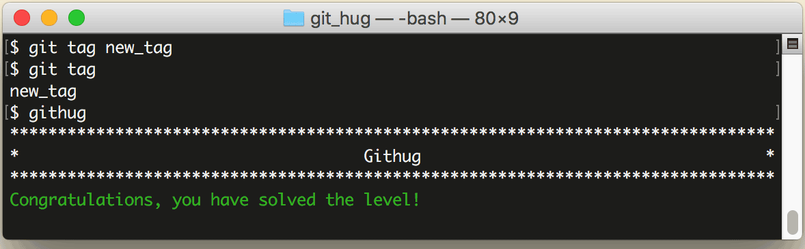

# 第17关 tag

> We have a git repo and we want to tag the current commit with 'new_tag'.
> 
> 为仓库当前的提交增加一个名为 'new_tag' 的标签。

把开发一个项目当作一次旅行，如果每个 commit（提交） 都是从窗外晃过的一根电线杆，那么 tag（标签） 就是可以停靠的车站，你可以选择一刻不停地开到终点，也可以歇下脚看看风景再继续前行。镜头拉回到第17关，上面的比喻就是 commit 和 tag 的区别，commit 是细粒度的、面向程序员的，每写一个函数、每修正一个 bug，都可以提交一个 commit，而 tag 是粗粒度的、面向用户的，一般只有在增加或优化了一个用户可感知的功能时，才打一个 tag，软件的版本号就是最常见的 tag 形式，一个新的版本号意味着要对外发布一个新的 release 包。

打标签的命令如下：

```
$ git tag your-tag
$ git tag your-tag a38862a5a860
$ git tag
$ git tag -d your-tag
```

第1条命令是给最近一次提交打标签；第2条命令是给指定的某次提交打标签，后面要写上提交的 hash 值或者 hash 值的前几位；第3条命令是列出所有的标签；第4条是删除标签。

第17关过关画面如下：

