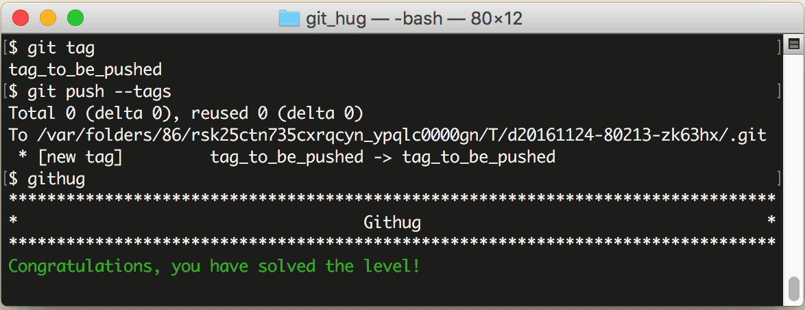

# 第18关 push_tags

> There are tags in the repository that aren't pushed into remote repository. Push them now.
>
> 本地仓库里有一些标签没有提交到远程仓库中，把它们提交到远程仓库。

在默认情况下标签是不会被 `git push` 命令提交到远程服务器的，也就是说，你在本地打的标签，如果没有刻意指定把它推送到服务器，别人是看不到的。

把标签推送到服务器的命令如下：

```
$ git push --tags
```

此命令执行之后，当别人用 `git clone` 或者 `git pull` 从远程仓库读取时，就会看到你打过的标签了。

第18关过关画面如下：

