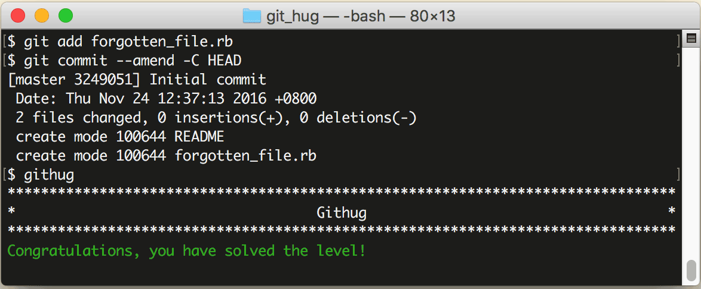

# 第19关 commit_amend

> The 'README' file has been committed, but it looks like the file 'forgotten_file.rb' was missing from the commit.  Add the file and amend your previous commit to include it.
> 
> 已经提交了文件 'README'，但忘记提交文件 'forgotten_file.rb' 了。修改前一次提交，把这个文件加进去。

文件没提交全是很常见的小失误，解决办法就是先用 `git add` 把忘记提交的文件添加到暂存区，再用 `git commit` 命令加 `--amend` 参数把文件追加到最近一次提交中去，语法如下：

```
$ git commit --amend
$ git commit --amend -m "new message"
$ git commit --amend -C HEAD
```

第1条命令会弹出一个编辑器，供你编辑提交说明；第2条命令会用 "new message" 代替原有的提交说明；第3条命令会直接使用原有的提交说明，其中 `-C` 表示使用已提交过的说明，`HEAD` 表示最近一次提交，加在一起就是使用最近一次的提交说明。

第19关过关画面如下：

