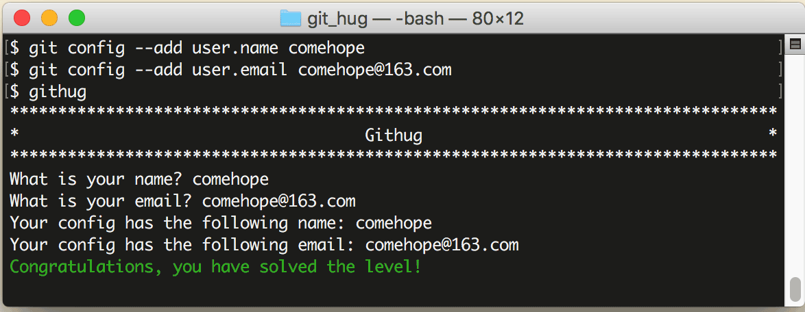

# 第2关 config

> Set up your git name and email, this is important so that your commits can be identified.
> 
> 设置你的用户名和电子邮件地址。

仓库初始化之后要做的第一件事就是设置你的用户名称和电子邮件地址，以后每一次 Git 提交都会使用这些信息，用于记录代码是谁提交的。

配置信息分为全局配置和本地配置（即当前仓库的配置），使用 `git config` 命令维护，读写全局配置用 `--global` 参数，读写本地配置用 `--local` 参数。（注：还有一层系统配置，但用得少，此处不议。）

查看指定的配置信息用 `--get` 参数，如：

```
$ git config --get --local user.name
$ git config --get --global user.name
$ git config --get user.name
```

第1条命令是查看本地配置的用户名，第2条命令是查看全局配置的用户名，第3条命令是查看优先级最高的用户名，如果有本地配置项，就读取本地配置项，如果没有本地配置项，就读取全局配置项。

增加配置信息用 `--add` 参数，如：

```
$ git config --add --local user.name your-name
$ git config --add --global user.name your-name
$ git conifg --add user.name your-name
```

第1条命令是在本地配置中增加用户名，第2条命令是在全局配置中增加用户名，第3条命令和第1条命令相同，也是在本地配置中增加用户名。

掌握了以上读写配置信息的方法，再知道了用户名和电子邮件地址的键值分别是 user.name 和 user.email，完成这关的任务就很简单了：

