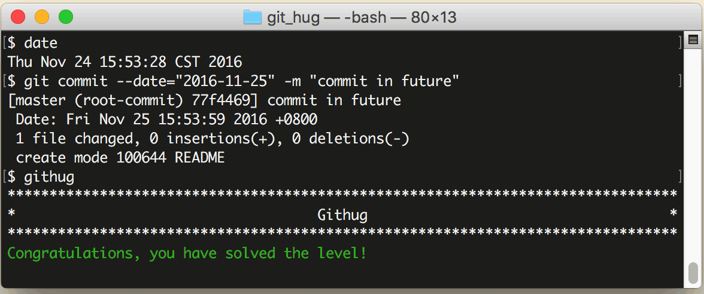

# 第20关 commit_in_future

> Commit your changes with the future date (e.g. tomorrow).
> 
> 把提交日期设定在未来的某一天（比如明天）。

这关的任务很奇怪，要求把提交时间设定在未来，可是 Git 这台时光机只能开往过去不能开往未来，它只负责把发生过的事管理好，所以把提交时间设定在未来某个时间点实在没有道理啊！如果本关是想考核对 `git commit` 命令的 `--date` 参数的运用，应该要求把提交日期设定在过去，比如昨天或者上周，才是合理的应用场景。

设定提交时间的命令如下：

```
$ git commit
$ git commit --date=“2016-10-10T12:01:01”
$ git commit --date="10 minutes ago"
$ git commit --date="noon yesterday"
$ git commit --date="last friday"
```

第1条命令没有 `--date` 参数，所以默认使用当前时间作为提交时间；第2条命令的提交时间设置为“2016年10月10日的12点01分01秒”；第3条命令的提交时间设置为“10分钟之前”；第4条命令的提交时间设置为“昨天中午12点”；第5点命令的提交时间设置为“上周五的现在时刻”。第2条设置的是绝对时间，后3条设置的都是相对时间。

第20关过关画面如下：

