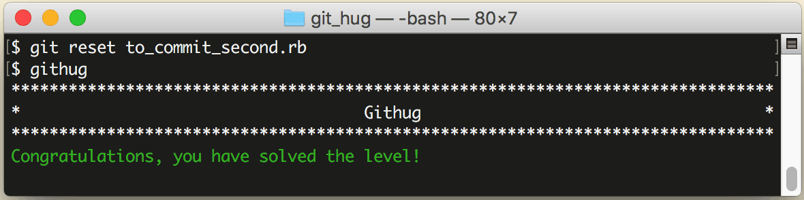

# 第21关 reset

> There are two files to be committed.  The goal was to add each file as a separate commit, however both were added by accident.  Unstage the file 'to_commit_second.rb' using the reset command (don't commit anything).
> 
> 已经有2个文件即将被提交（即是已加入到暂存区），但为了把每个文件分别提交，需要把 'to_commit_second.rb' 这个文件用 reset 命令从暂存区中移出（不要提交任何文件）。

呵呵，本关和第12关很像啊，都是要从暂存区移出文件，甚至你用第12关的 `git rm --cached` 命令就可以完成任务，但是既然用已有的知识就可以解决，为什么还要专门设这么一关？

请再回忆一下第3关的“Git 文件生命周期”那张图（这张图真是很重要啊，我们在第9关也曾经回忆过一次）。处于工作目录的文件，可能会有2种状态，一种是 untracked，表示这是以前仓库没有的文件，它是新来的；一种是 modified，表示这是仓库里已有的文件，它被修改过了。虽然不管处于哪种状态，把它们加入到暂存区的命令都是 `commit add`，但这条命令其实包含了2种可能的含义：给仓库增加一个文件、或者修改仓库已有的文件，而把文件从暂存区移出的操作也就相对应地有了2种场景，一种是把新增的文件从暂存区移出，一种是把修改过的文件从暂存区移出。第12关和本关就是为了考察这2种场景而设计的，第12关的针对第1种场景，本关针对第2种场景。

把一个已修改过的文件从暂存区移出的命令是：

```
$ git reset your-file
```

第21关过关画面如下：

