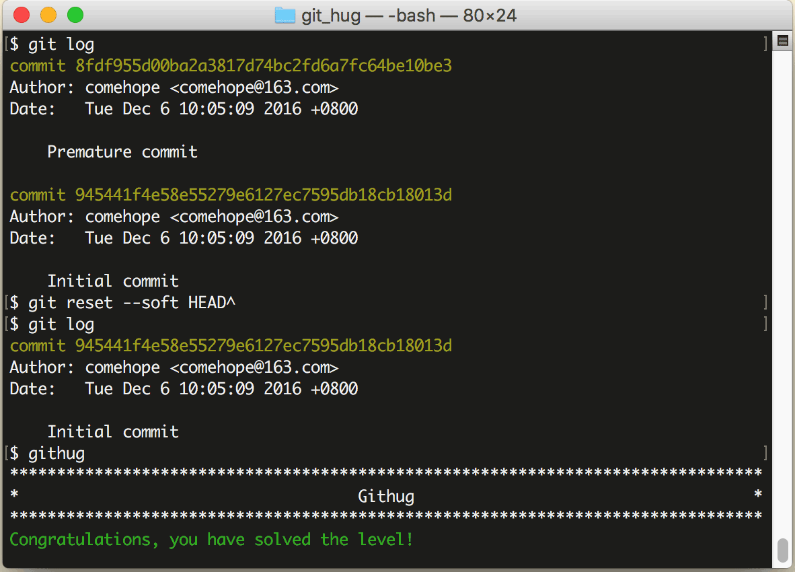

# 第22关 reset_soft

> You committed too soon. Now you want to undo the last commit, while keeping the index.
> 
> 你仓促地提交了代码，现在想取消最后一次提交，同时保持暂存区不变。

这又是一个撤销操作，撤销的是最后一次 `git commit` 命令，语法如下：

```
$ git reset --soft HEAD^
```

`git reset` 命令有很多复杂的参数，这里暂不细说，其中 `--soft HEAD^` 表示取消最后一次提交操作，并且暂存区和工作目录的文件均不受影响。

第19关的 `git commit --amend` 命令就相当于是先 `git reset --soft` 再 `git commit`。

在执行此命令之后，查看日志时会发现最后一次提交的日志消失了。

第22关过关画面如下：

