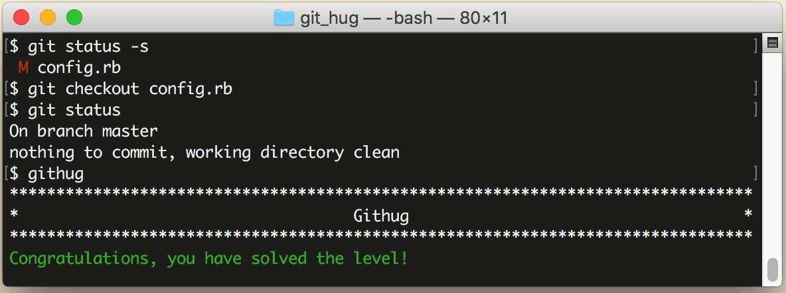

# 第23关 checkout_file

> A file has been modified, but you don't want to keep the modification.  Checkout the 'config.rb' file from the last commit.
>
> 一个文件已被修改过，但你不想保留修改过的内容。从最后一次提交中 checkout 出 'config.rb' 文件。

这还是一个撤销操作。如果你想放弃工作目录中已经修改过的内容，就用这个命令：

```
$ git checkout your-file
```

Git 会用最后一次提交的文件覆盖掉工作目录中的同名文件。但做这个操作一定要谨慎，因为这个操作是不可以被撤销的，执行之后你修改过的内容就找不回来了。

第23关过关画面如下：

