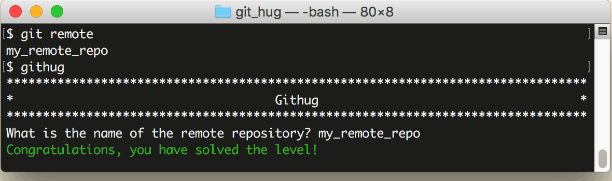

# 第24关 remote

> This project has a remote repository.  Identify it.
> 
> 这个项目有一个远程仓库，找出它。

我们大部分时间都是在操作本地仓库，与远程仓库相关的命令也不多，比如前面的23关中，也只有第5、第6、第18关这3关涉及到了远程仓库。接下来的5关将集中学习有关远程仓库的知识。

我们先来描述一下应用场景。你和其他人同时开发一个项目，大家都从中心仓库 clone 了文件到本地，然后分头工作，此时你只连接了一个远程仓库——中心仓库。如果你的同伴写了一个函数，正好你可以用到它，那么你可以把这个函数 pull 到你的仓库里，这时你就连接了第二个远程仓库——同伴的仓库，你们俩绕过了中心仓库，直接实现了私下交流，这也下是 Git 被称为分布式版本管理系统的原因。

每一个开发者都可以连接多个远程仓库，但是 URL 很长不好记，所以 Git 允许你为每个远程仓库命名，提高效率。

要查看你的项目连接了哪些远程仓库，用下面的命令：

```
$ git remote
```

第24关过关画面如下：

