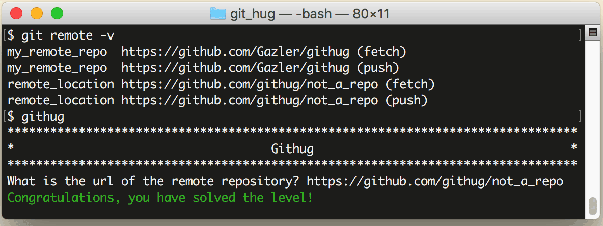

# 第25关 remote_url

> The remote repositories have a url associated to them.  Please enter the url of remote_location.
> 
> 这个远程仓库有一个与它相关的 URL，请输入远程仓库 remote_location 的 URL 地址。

承上关，在 `git remote` 命令后面加一个 `-v` 参数就可以查询远程仓库的 URL 了。

```
$ git remote -v
```

在查询结果中，每个远程仓库分别列出了 fetch 和 push 的地址，这是因为在有些情况下 fetch 和 push 的地址是不一样的。

第25关过关画面如下：

