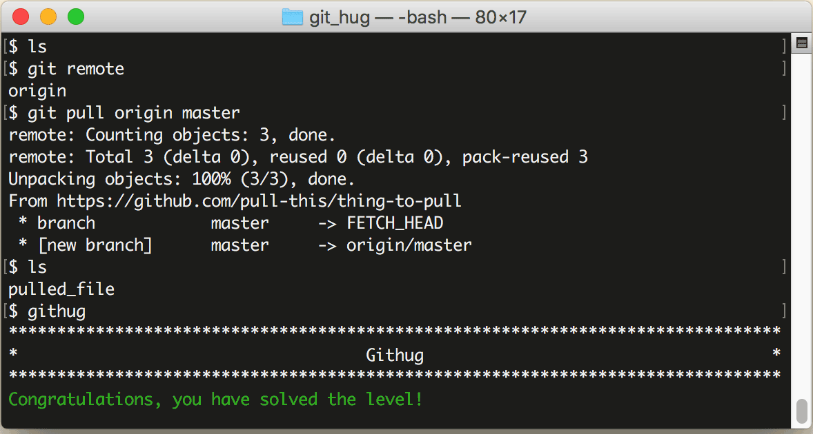

# 第26关 pull

> You need to pull changes from your origin repository.
> 
> 你需要从远程仓库 origin 拉取更新。

当有多人合作一起开发一个项目时，就不止是你一个人向远程仓库提交代码了，你的伙伴也会向远程仓库提交代码。为了得到远程仓库的最新内容，要用下面的命令把内容抓下来：

```
$ git pull remote-name branch-name
```

其中，remote-name 是远程仓库的名字，branch-name 是远程仓库的分支名字，如果是主干，那就是 master。该命令执行之后，远程仓库的代码会自动合并到本地项目中。

第26关过关画面如下：

