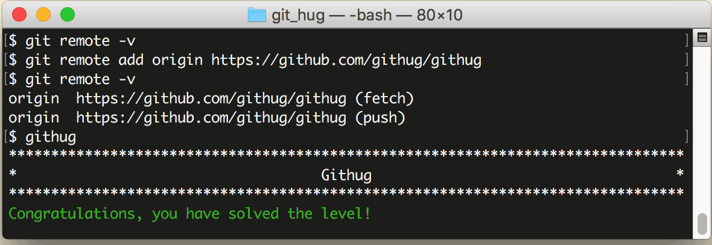

# 第27关 remote_add

> Add a remote repository called 'origin' with the url https://github.com/githug/githug
> 
> 添加一个远程仓库，名为 'origin'，url 是 https://github.com/githug/githug

在第25关，我们用 `git remote -v` 列出了多个远程仓库的地址，那这些地址是怎么添加的呢？

如果你的项目是 clone 来的，那么 Git 会并把 clone 命令的仓库地址保存下来。如果要手工添加远程仓库，请用下面的命令：

```
git remote add remote-name remote-url
```

第27关过关画面如下：

