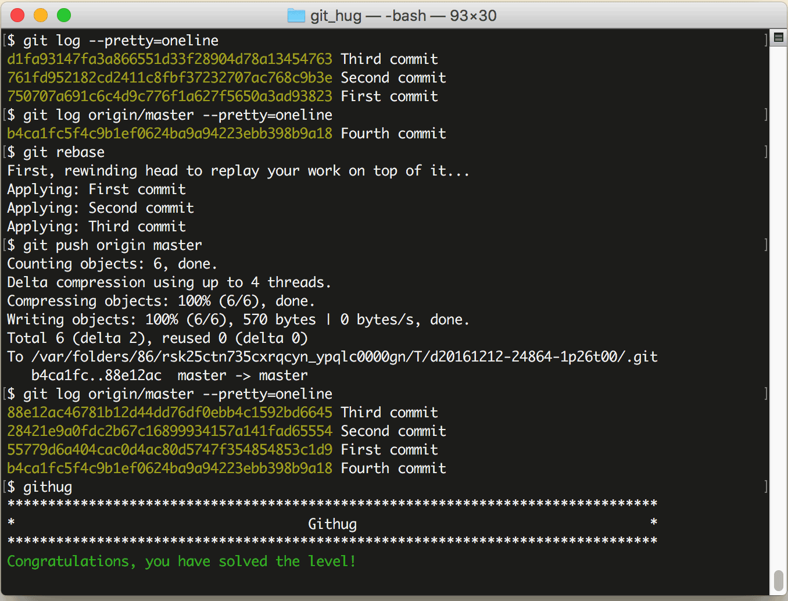

# 第28关 push

> Your local master branch has diverged from the remote origin/master branch. Rebase your commit onto origin/master and push it to remote.
> 
> 你本地仓库的代码是由远程仓库的 origin/master 分支创建的。rebase 你的更新到 origin/master，然后提交到远程仓库。

当你和其他伙伴一起开发时，你们都从远程仓库把文件 clone 到本地，然后分头开发，再分头推送到远程仓库中，推送命令如下：

```
$ git push remote-name branch-name
$ git push -u remote-name branch-name
$ git push
```

第1条命令是把本地的文件推送到远程仓库，remote-name是远程仓库名，branch-name是分支名，如果你没有重命名过它们，那它们默认的名称分别是 origin 和 master；第2条命令加了一个 `-u` 参数，目的是让 Git 把 remote-name 和 branch-name 记住，下次就不用再写这2个参数了；第3条命令就是使用过 `-u` 参数以后的推送命令，不需要任何参数了。

多人开发时，推送是有先有后的，按照 Git 的规则，在你推送时如果已经有人比你早推送了，你若再推送就会收到一个 "non-fast forward" 的提示，直译就是“不能快进”。那么此时你至少有2种办法来解决：

方法一，先用 `git pull` 命令把远程仓库的最新代码合并到本地，然后再提交。这时本地的提交和远程的提交按时间顺序混合排列。

方法二，用 `git rebase` 命令把本地仓库的更新排到远程仓库更新之后，那这时候本地仓库的所有提交都排在远程仓库的最后一次提交之后。

本关考核的就是用 `git rebase` 方法来解决问题。

本关的场景是本地仓库有3次更新（分别名为 First commit, Second commit, Third commit），远程仓库有1次更新（名为 Fourth commit），在 rebase 并且 push 之后，远程仓库就会有4次更新了。

第28关过关画面如下：

