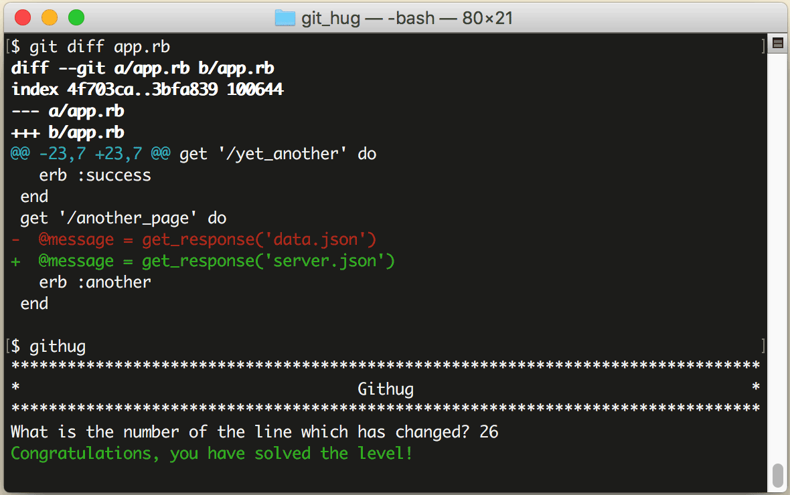

# 第29关 diff

> There have been modifications to the 'app.rb' file since your last commit. Find out whick line has changed.
> 
> 最后一次提交之后，你又修改了 'app.rb' 这个文件。找到哪一行被修改过。

如果仓库中的文件被修改过，它的状态就变为 'modified'，可以使用下面的命令查看被修改的细节：

```
$ git diff
$ git diff your-file
```

第1条命令是列出所有被修改过的文件的细节，第2条命令是列出指定文件的被修改过的细节。

比如，你有一个名为 a.txt 的文件，内容如下：

```
a1
a2
a3
a4
a5
a6
a7
a8
a9
```

然后，你把其中的 'a5' 改成了 'bbb5'，内容变成：

```
a1
a2
a3
a4
bbb5
a6
a7
a8
a9
```

那么 `git diff` 的结果是这样的:


其中 `@@ -2,7 +2,7 @@` 表示修改的内容是从第2行至第7行，接下来列出第2行至第7行的内容（其实只修改了第5行这1行，但会列出这1行的前3行和后3行）。其中红色的 `-a5` 和绿色的 `+bbb5` 表示把 'a5' 改为了 'bbb5'。

第29关过关画面如下：

