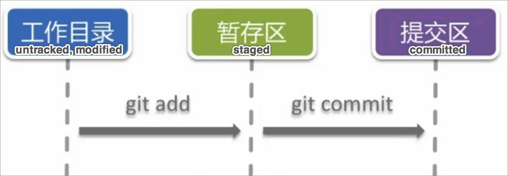
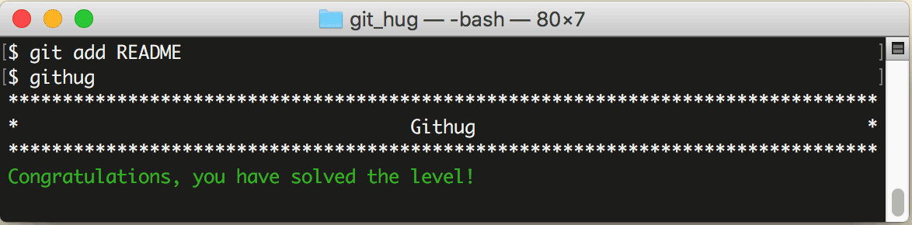

# 第3关 add

> There is a file in your folder called 'README', you should add it to your staging area.
> 
> 目录中有一个名为 'README' 的文件，把它添加到暂存区。

仓库初始化了，用户信息也设置好了，就该管理文件了。我们先看一下 Git 文件的生命周期：



工作目录里的文件不会自动被 Git 管理，要用 `git add` 命令把它添加到暂存区，暂存区可以存多个文件，举例来说，假设开发一个页面，要先写一个 html 文件，再写一个 css 文件，再写一个 js 文件，那就把它们逐个添加到缓存区，这时缓存区里有3个文件了，再用 `git commit` 命令把它们一起提交到本地仓库（图中的提交区）。以上流程就是第3关和第4关要考核的内容。

把文件添加到暂存区的命令是这样的：

```
$ git add README
$ git add *.md
$ git add -A
```

第1条命令表示把 README 这个文件添加到暂存区，第2条命令表示把 md 扩展名的文件都添加到暂存区，第3条命令表示把所有没加到暂存区的文件都添加到暂存区。

第3关过关画面如下：

