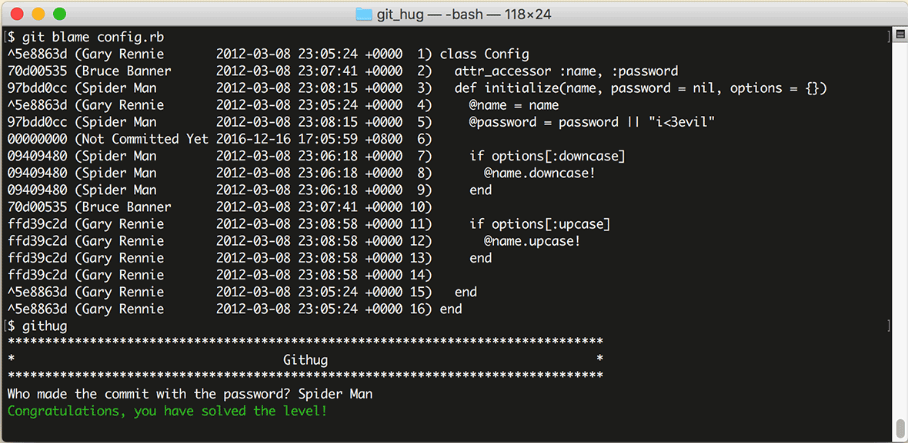

# 第30关 blame

> Someone has put a password inside the file 'config.rb' find out who it was.
> 
> 有人在 'config.rb' 中植入了一个密码，请找出这是谁干的。

当系统曝出 bug 或者漏洞，要查清问题的来源时，首先定位问题代码，其次定位是谁引入了错误。Git 记录了详细的更新日志，所以通过 Git 提供的一个专门的命令就可以定位开发者：

```
$ git blame your-file
```

在结果中会列出指定文件的所有代码，每行代码的左侧会列出它最后一次被更新时的 HASH 值、开发者和时间，通过这些信息，你就可以分析每一行代码被谁编辑过了。

第30关过关画面如下：

