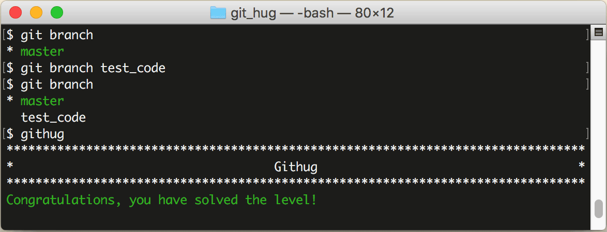

# 第31关 branch

> You want to work on a piece of code that has the potential to break things, create the branch test_code.
> 
> 你想要修改一处代码，在修改过程中可能会引起一些问题，所以要创建一个分支 test_code 来修改。

接下来的10关都和分支有关。
如果你想在不影响主线的情况下进行安全的开发，就要以主线为基础创建一个分支，然后在分支上修改，最后再把分支合并到主线上。实际上，一般情况下都是在分支上工作的，因为在一个团队中，你和你的伙伴共享主线，直接在主线下工作会影响其他人，所以每个人都分别在各自的分支上工作。

分支的常用命令如下：

```
$ git branch branch-name
$ git branch
```

第1条语句用于创建分支，branch-name 就是你要创建的分支名称；第2条语句用于列出全部分支。

第31关过关画面如下：

