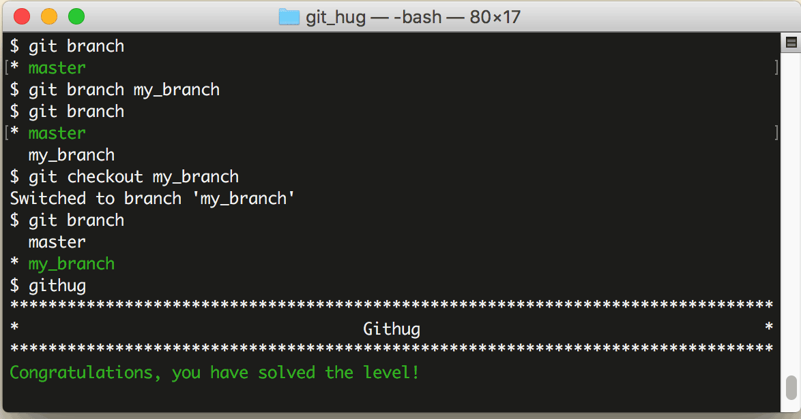

# 第32关 checkout

> Create and switch to a new branch called my_branch.  You will need to create a branch like you did in the previous level.
> 
> 创建并切换到新分支 my_branch。你要像上一关那样先创建一个分支。

上一关我们创建了分支，但是还没有切换到新分支上。如果你仔细观察，会发现 ```git branch``` 语句的结果中，在 ```master``` 前面有一个 ```*``` 号，它表示当前你所在的分支。

切换分支的语句是：

```
$ git checkout branch-name
$ git checkout -b branch-name
$ git checkout -
```

第1条语句用于切换到指定的分支；第2条语句加了 ```-b``` 参数，表示创建一个分支并且切换到这个新建的分支，相当于连续执行 ```git branch branch-name``` 和 ``` git checkout branch-name```；第3条语句用于切换到上次所在的分支，当你经常在2个分支间来回切换时，用这个命令会比较方便。

不知你是否还记得，第23关我们用到了这样的命令：

```
$ git checkout your-file
```

它的作用是撤销对一个文件的修改。虽然从形式上看这个命令和本关的命令很相似，但因为参数的含义不一样，一个是文件名，一个是分支名，所以功能是完全不一样的。

第32关过关画面如下：

