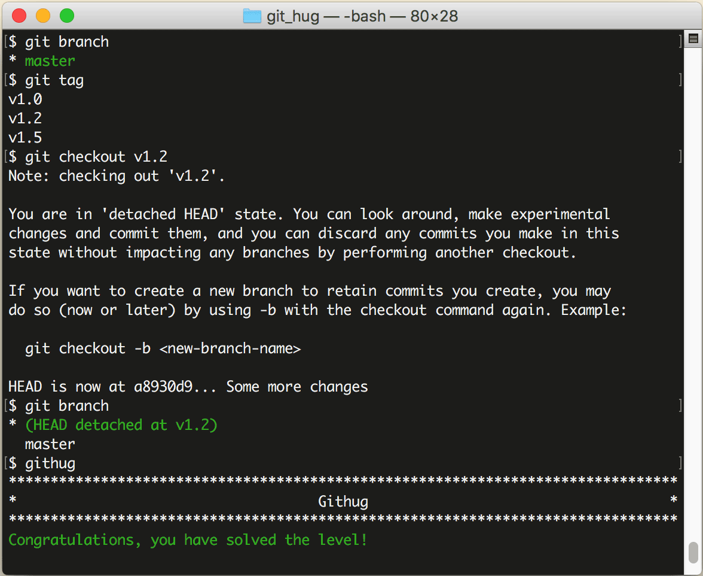

# 第33关 checkout_tag

> You need to fix a bug in the version 1.2 of your app. Checkout the tag `v1.2`.
> 
> 你要在 1.2 版本中修复一个 bug，切换到 tag 'v1.2'。

在第17关我们学习了如何创建 tag，tag 是一个有语义的标签，便于记忆，我们可以把版本号或其他有特定含义的词语作为 tag。当我们要切换到指定的 tag 时，采用以下命令：

```
$ git checkout tag-name
```

你一定发现了，这个命令也和切换到分支的命令形式是一样的啊！第17关、第32关、第33关这三关的命令形式都一样，只因参数的含义不同，一个是文件名，一个是分支名，一个是标签名，结局就各不相同。

第33关过关画面如下：

