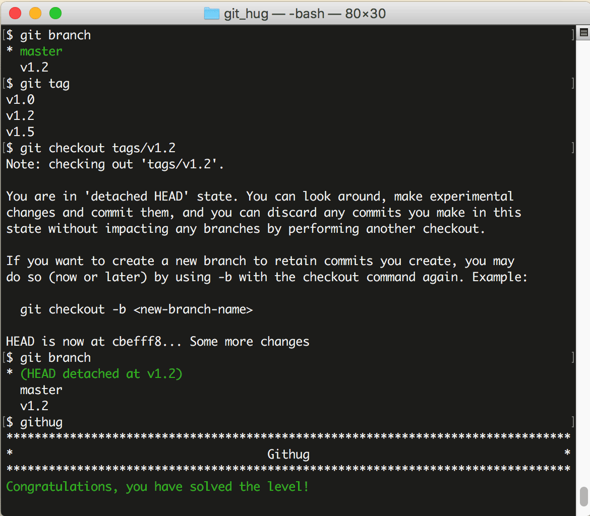

# 第34关 checkout_tag_over_branch

> You need to fix a bug in the version 1.2 of your app. Checkout the tag `v1.2` (Note: There is also a branch named `v1.2`).
> 
> 你要在 1.2 版本中修复一个 bug，切换到 tag 'v1.2'（注意：现在有一个分支也叫 'v1.2'）。

如果存在一个和分支同名的 tag，比如都叫 'v1.2'，那么当执行 ```git checkout v1.2``` 命令时，是该切换到分支，还是该切换到 tag 呢？答案是切换到分支。

如果要切换到 tag，就需要按下面这样给出明确的说明：

```
$ git checkout tags/tag-name
```

第34关过关画面如下：

