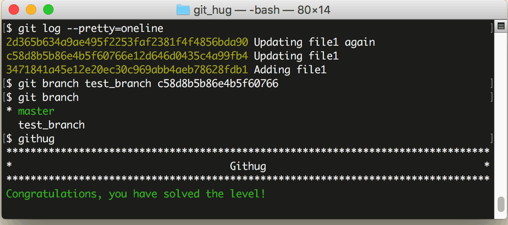

# 第35关 branch_at

> You forgot to branch at the previous commit and made a commit on top of it. Create branch test_branch at the commit before the last.
> 
> 你忘记了在上一个提交之间先创建一个分支就提交了。创建一个分支 test_branch 在最后一次提交之前。

默认情况下，你使用 ```git branch branch-name``` 语句创建分支时，创建出的分支与当前主线的内容是一样的，但是你也可以指定以主线的某一次提交为基础来创建分支，命令格式如下：

```
$ git branch branch-name hash-code
```

上面命令的最后一个参数表示 ```git commit``` 命令为某次提交生成的 HASH 值。

第35关过关画面如下：

