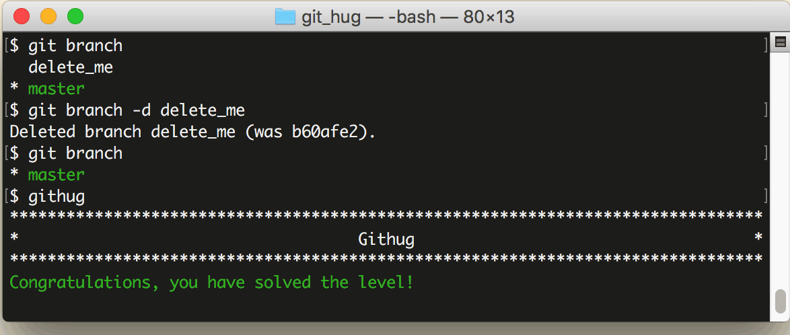

# 第36关 delete_branch

> You have created too many branches for your project. There is an old branch in your repo called 'delete_me', you should delete it.
> 
> 你为这个项目创建了太多的分支。有一个旧分支名为 'delete_me'，删除掉它。

删除分支的命令如下：

```
$ git branch -d branch-name
```

和创建分支的区别在于增加了一个 ```-d``` 参数。

第36关过关画面如下：

