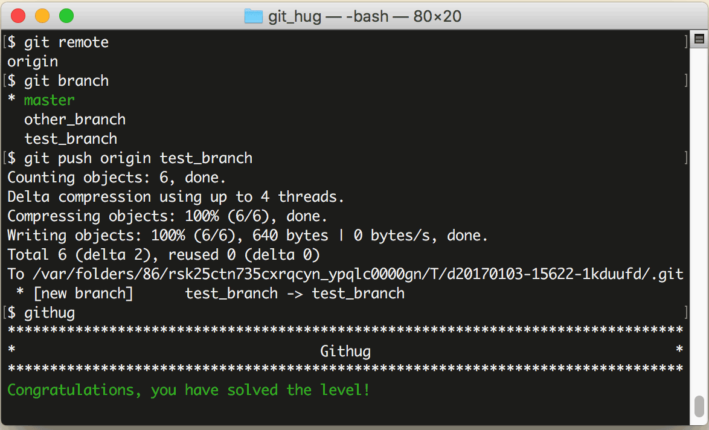

# 第37关 push_branch

> You've made some changes to a local branch and want to share it, but aren't yet ready to merge it with the 'master' branch.  Push only 'test_branch' to the remote repository.
> 
> 你的一个本地分支有一些修改，你想把它分享出去，但又不想合并到 master 分支上。仅把 'test_branch' 推送到远程仓库。

我们曾在第28关学习过推送命令，语法如下：

```
$ git push remote-name branch-name
```

其中 remote-name 是远程仓库名，branch-name 是分支名。

第37关过关画面如下：

