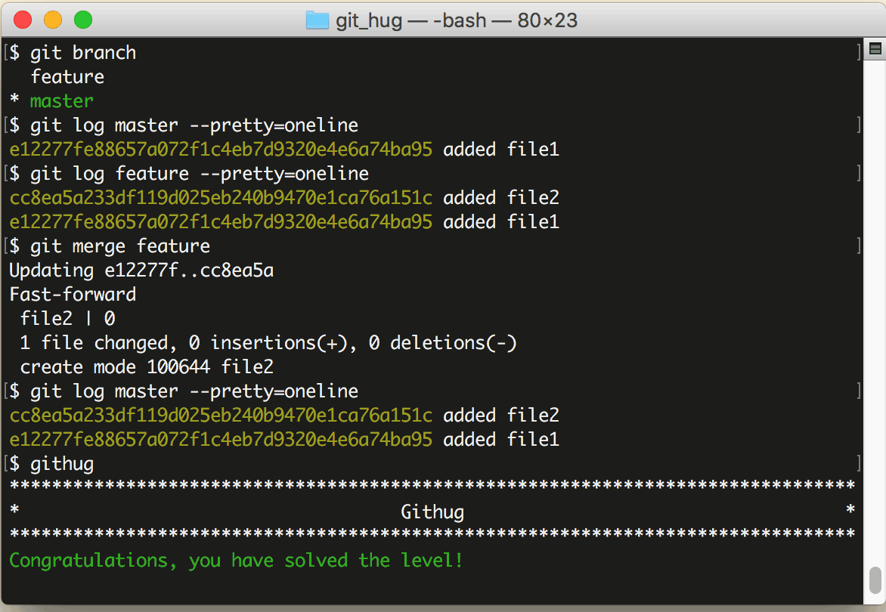

# 第38关 merge

> We have a file in the branch 'feature'; Let's merge it to the master branch.
> 
> 你有一个文件在分支 'feature'，把它合并到 master 分支。

当我们在分支完成修改和测试之后，就可以把分支合并到主线上了，它的命令是：

```
$ git merge branch-name
```

执行这条命令之前，要先切换到主线（一般是 master 分支），然后把待合并的分支名作为参数。

合并之后，在分支上修改过的文件的内容就会体现在主线上，而且日志中也加入了分支的修改日志。

如果遇到主线和分支修改了同一行代码，就会发生冲突，后面的关卡中我们还会学习如何解决冲突。

第38关过关画面如下：

