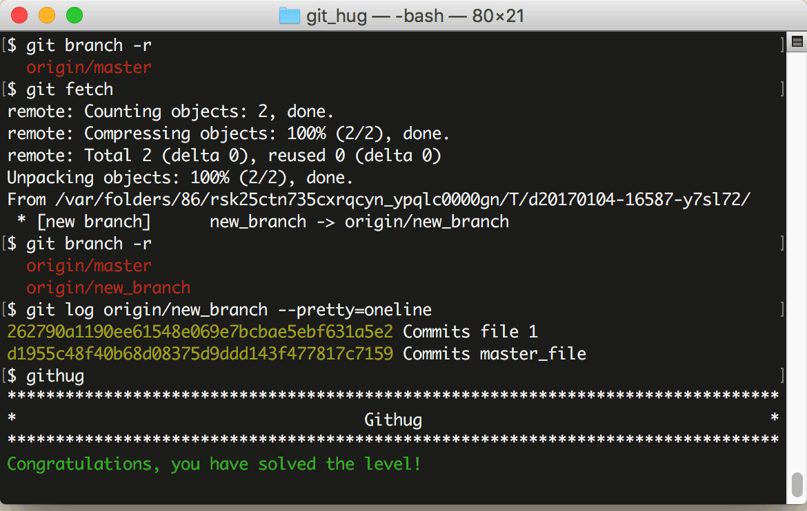

# 第39关 fetch

> Looks like a new branch was pushed into our remote repository. Get the changes without merging them with the local repository 
> 
> 看起来好像有新的分支推送到了远程仓库。得到新的修改而不要合并到本地仓库。

在第26关我们曾用 ```git pull``` 把远程仓库的更新拉到本地仓库，这个命令其实隐含了2个连续的动作，即 ```git fetch``` 和 ```git merge```。如果只是抓取数据而不合并，那就不能用 ```git pull``` ，而只用前一个动作 ```git fetch``` 就可以了，语法如下：

```
$ git fetch
$ git branch -r
$ git log remote-name/branch-name
```

第1条语句是把远程仓库的数据抓取到本地，但不合并到本地分支；第2条语句是查看远程分支列表，如果远程仓库有了新分支，在 ```git fetch``` 之后用 ```git branch -r``` 查看时会发现新分支的名称，在本关中新分支名为 'new_branch'；第3条语句用于查看远程分支的日志，比查看本地日志的 ```git log``` 语句多了远程仓库名和远程分支名这2个参数。

第39关过关画面如下：

