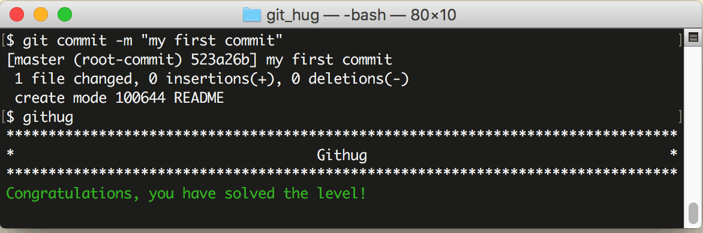

# 第4关 commit

> The 'README' file has been added to your staging area, now commit it.
>
> 'README' 文件已经添加到暂存区了，现在提交它吧。

承上关，把文件添加到暂存区以后，就该提交文件了。提交命令是 `git commit`，像下面这样写：

```
$ git commit -m "your message"
```

加一个 -m 参数，表示要写备注，备注写在最后。

第4关过关画面如下：

