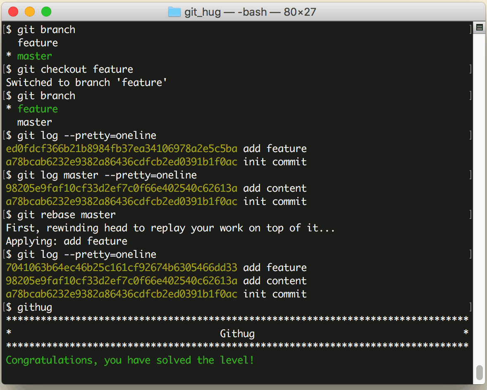

# 第40关 rebase

> We are using a git rebase workflow and the feature branch is ready to go into master. Let's rebase the feature branch onto our master branch.
> 
> 我们使用了 git rebase 工作流，feature 分支准备合并到 master。rebase 这个 feature 分支到我们的 master 分支之上。

在第28关我们曾经使用过一次 ```git rebase``` 命令，现在我们再详细讲解一下。

```git rebase``` 和 ```git merge``` 都是用来合并，各有优缺点，所以有些团队会约定合并时只能用 ```git merge``` 或只能用 ```git rebase```，如果约定只能用 ```git rebase``` 来合并，这种工作方式就被称为 'git rebase 工作流'。在用 ```git rebase``` 合并分支时，合并后的日志并非按各分支的提交时间排列，而是把一个分支的日志全部排列在另一个分支的日志之上，即使它们是并行开发的，在开发过程中交错提交，但看起来也好像是按先后顺序开发的一样。

以本题为例，master 是主线，从 master 创建出 feature 分支，此后，master 提交了一次，提交说明是 “add content”，feature 也提交了一次，提交说明是 “add feature”，这时在 master 上执行以下命令：

```
$ git rebase feature
```

那么 master 的日志就会变成 "add content" 在 "add feature" 之上。

而反过来，如果是在 feature 上执行以下命令：

```
$ git rebase master
```

那么 feature 的日志就会变成 "add feature" 在 "add content" 之上。

第40关过关画面如下：

