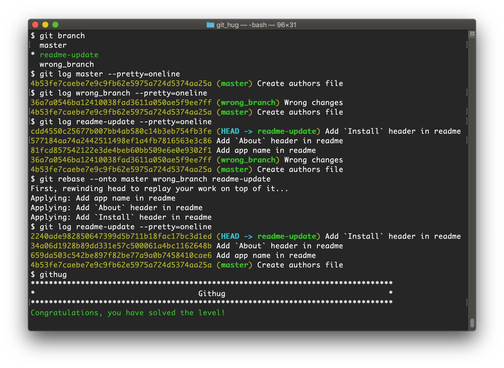

# 第41关 rebase_onto

> You have created your branch from `wrong_branch` and already made some commits, and you realise that you needed to create your branch from `master`. Rebase your commits onto `master` branch so that you don't have `wrong_branch` commits.
> 
> 你从 `wrong_branch` 分支创建了一个名为 `readme-update` 的分支，在此分支上做了几次提交，突然你意识到你不应该从 `wrong_branch` 创建分支，而应该从 `master` 创建分支。现在你需要把 `readme-update` 上做过的提交迁移到 `master` 分支上。

（此处尚待详细讲解）

第41关过关画面如下：

