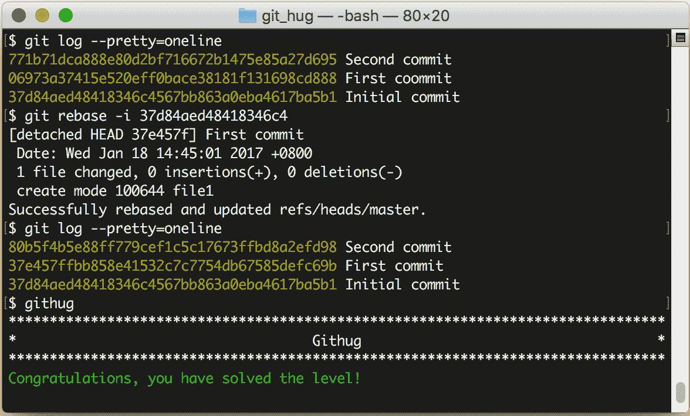

# 第45关 rename_commit

> Correct the typo in the message of your first (non-root) commit.
> 
> 在第一次提交时有一个拼写错误，修正它。

在使用 Git 的过程中，难免会出现要改写提交内容的情况，Git 提供了非常强大的修改历史的工具，我们就以本关为例，详细说明如何修改历史，并在接下来的第46关和第48关再做另外2个练习。

先看一下提交日志：

```
$ git log --pretty=oneline
771b71dca888e80d2bf716672b1475e85a27d695 Second commit
06973a37415e520eff0bace38181f131698cd888 First coommit
37d84aed48418346c4567bb863a0eba4617ba5b1 Initial commit
```

一共有过3次提交，注意其中哈希值为 "06973a37415e520eff" 的这次提交，提交说明 "First coommit" 中的第2个单词拼错了。

修改提交历史的命令格式是：

```
$ git rebase -i hash-code
```

我们已经在第40关接触过 ```git rebase``` 命令，当时是用它来合并分支。但是加了 ```-i``` 参数之后，用途就变为修改提交历史了。其后再跟一个某一条提交日志的哈希值，表示要修改这条日志之前的提交历史。

现在，找到 "First coommit" 下面一条日志的哈希值 "37d84aed48418346c4"，然后输入下面的命令：

```
$ git rebase -i 37d84aed48418346c4
```

这时，会启动文本编辑器，显示如下内容：

```
pick 06973a3 First coommit
pick 771b71d Second commit
```

这2行是历史日志，但和 `git log` 的区别在于 `git log` 是按更新时间从后到前显示日志，而这里是按从前到后显示。每一行的前面有一个命令词，表示对此次更新执行什么操作，有以下几种命令：

* "pick"，表示执行此次提交；
* "reword"，表示执行此次提交，但要修改备注内容；
* "edit"，表示可以修改此次提交，比如再追加文件或修改文件；
* "squash"，表示把此次提交的内容合并到上次提交中，备注内容也合并到上次提交中；
* "fixup"，和 "squash" 类似，但会丢弃掉此次备注内容；
* "exec"，执行命令行下的命令；
* "drop"，删除此次提交。

本关就使用 "reword" 命令来完成任务。把第1行前面的 "pick" 改为 "reword"（注意，不用改哈希值后面的备注内容），如下：

```
reword 06973a3 First coommit
pick 771b71d Second commit
```

接下来保存并退出，马上系统会再次打开编辑器，显示以下内容：

```
First coommit

# Please enter the commit message for your changes.
```

这时，你把 "coommit" 改为 "commit"，保存并退出，再查看日志，就会发现历史日志的备注内容已经改变了。

第45关过关画面如下：

