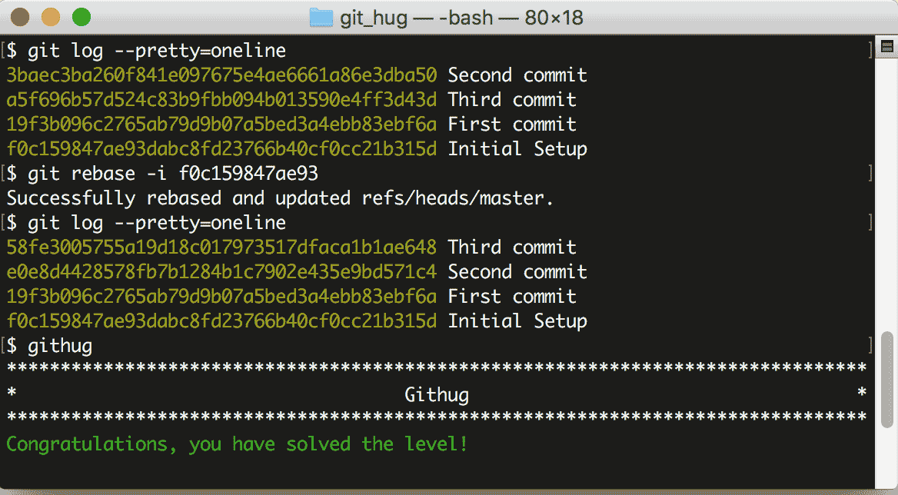

# 第48关 reorder

> You have committed several times but in the wrong order. Please reorder your commits.
> 
> 你提交过几次，但是提交的顺序错了，请调整提交顺序。

在第45关和第46关我们使用 ```git rebase -i``` 命令修改了历史日志的提交说明、把多次提交合并成了一次，在本关，我们要用这个命令来调整提交顺序。

先查一下提交日志：

```
$ git log --pretty=oneline
3baec3ba260f841e097675e4ae6661a86e3dba50 Second commit
a5f696b57d524c83b9fbb094b013590e4ff3d43d Third commit
19f3b096c2765ab79d9b07a5bed3a4ebb83ebf6a First commit
f0c159847ae93dabc8fd23766b40cf0cc21b315d Initial Setup
```

从上面的查询结果看出，"Second commit" 和 "Third commit" 的次序颠倒了。我们找到最后一条日志的哈希值 "f0c159847ae93"，然后输入下面的命令：

```
$ git rebase -i f0c159847ae93
```

系统自动打开文本编辑器，显示出了历史日志：

```
pick 19f3b09 First commit
pick a5f696b Third commit
pick 3baec3b Second commit
```

把第2行和第3行的内容调整一下顺序，即这样：

```
pick 19f3b09 First commit
pick 3baec3b Second commit
pick a5f696b Third commit
```

然后保存退出，系统就会按照调整过的顺序重新执行一遍提交操作。再查看日志，发现顺序已经调整好了。

```
$ git log --pretty=oneline
58fe3005755a19d18c017973517dfaca1b1ae648 Third commit
e0e8d4428578fb7b1284b1c7902e435e9bd571c4 Second commit
19f3b096c2765ab79d9b07a5bed3a4ebb83ebf6a First commit
f0c159847ae93dabc8fd23766b40cf0cc21b315d Initial Setup
```

第48关过关画面如下：

