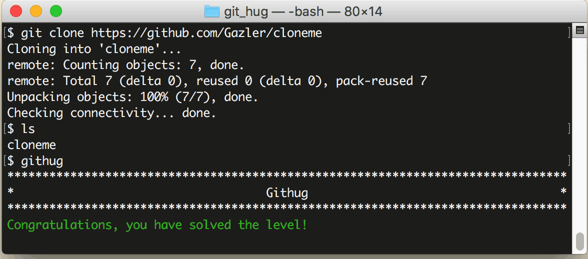

# 第5关 clone

> Clone the repository at https://github.com/Gazler/cloneme.
>
> 克隆远程仓库 https://github.com/Gazler/cloneme 到本地。

回忆一下第1关，当时我们是把本地目录初始化成 Git 仓库的，除此之外，还有一种情况可以创建 Git 仓库，就是把服务器上的仓库克隆到本地，它的命令格式是：

```
$ git clone http://remote.repo.url
```

此命令执行之后，就在当前目录下创建一个与远程仓库同名的子目录，同时把远程仓库的所有文件复制到这个新建的子目录中。

第5关过关画面如下：

