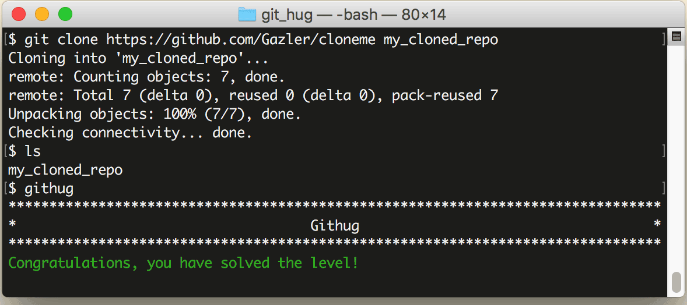

# 第6关 clone_to_folder

> Clone the repository at https://github.com/Gazler/cloneme to 'my_cloned_repo'.
>
> 克隆远程仓库 https://github.com/Gazler/cloneme 到本地的 'my_cloned_repo' 目录。

要是你想把克隆到本地的仓库命名为一个和远程仓库不一样的目录名，就在 `git clone` 的后面追加一个自定义的目录名，像这样：

```
$ git clone http://remote.repo.url your-folder
```

第6关过关画面如下：

