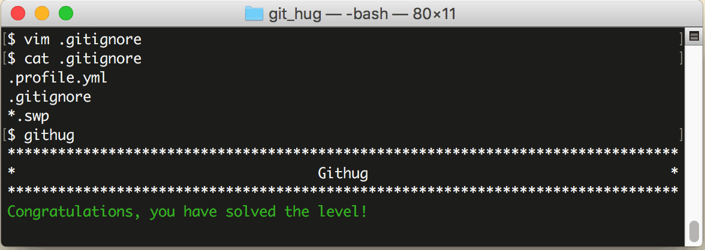

# 第7关 ignore

> The text editor 'vim' creates files ending in '.swp' (swap files) for all files that are currently open.  We don't want them creeping into the repository.  Make this repository ignore '.swp' files.
> 
> 文本编辑器 'vim' 会自动创建以 '.swp' 结尾的临时交换文件，我们不想让这些文件进入到仓库，让仓库忽略掉这些 '.swp' 文件。

在开发时经常会因编辑器、IDE、编译器或其他什么程序自动生成一些临时文件、日志文件什么的，这些都不算源代码，所以不应该让 Git 来管理。

.gitignore 文件存放在仓库的根目录下，专用于配置可忽略文件的规则，它是一个文本文件，每行书写一条规则，常用的规则举例如下：

```
# 忽略掉文件名是 foo.txt 的这个文件
foo.txt

# 忽略所有 log 文件
*.log

# 但 important.log 是个例外，不忽略
!imprtant.log
```

第7关过关画面如下：

