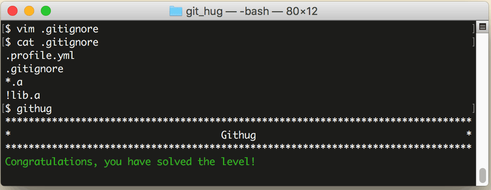

# 第8关 include

> Notice a few files with the '.a' extension.  We want git to ignore all but the 'lib.a' file.
> 
> 我们想忽略以 '.a' 为扩展名的文件，但不忽略 'lib.a' 这个文件。

在上一关讲到的忽略规则中，最后一条是把某个文件排除在已有规则之外，正好用它来解这一关：

