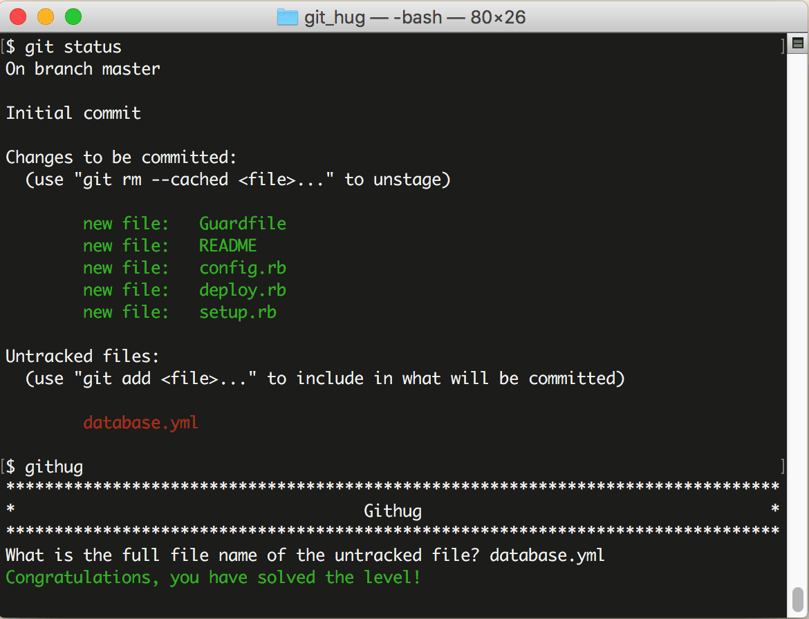

# 第9关 status

> There are some files in this repository, one of the files is untracked, which file is it?
> 
> 仓库中有一个文件是未被 Git 管理的，请问是哪一个文件？

Git 管理下的文件有多种状态，在工作中你经常需要先查询文件状态才能决定下一步做什么或怎么做，所以它的重要性和 Linux 的 `ls` 命令是一样重要的，是几乎所有操作的起点。

查看仓库状态的命令是：

```
$ git status
$ git status -s
```

第1条命令表示以详细格式查看，第2条命令表示以紧凑格式查看。默认的详细格式包含以下内容：

* untracked：仓库里新建的文件，或者从别的地方复制到仓库里的文件，它们的状态都是 "untracked"，它们被用红字显示在查询结果的 "Untrakced files" 段落中。

* modified：被编辑过的文件的状态就变为 "modified"，它们被用红字显示在查询结果的 "Changes not staged for commit" 段落中。

* staged：通过 `git add` 命令加入到暂存区的文件的状态就变为 "staged"，它们被用绿字显示在查询结果的 "Changes to be committed" 段落中。

如果上面的状态把你搞乱了，请翻到前面第3关，再仔细看一下“Git 文件生命周期”那张图。

第9关和第10关考核是正是你对 git status 查询结果的阅读能力，第9关是要你从查询结果中识别出 untracked 状态的文件。

第9关过关画面如下：

